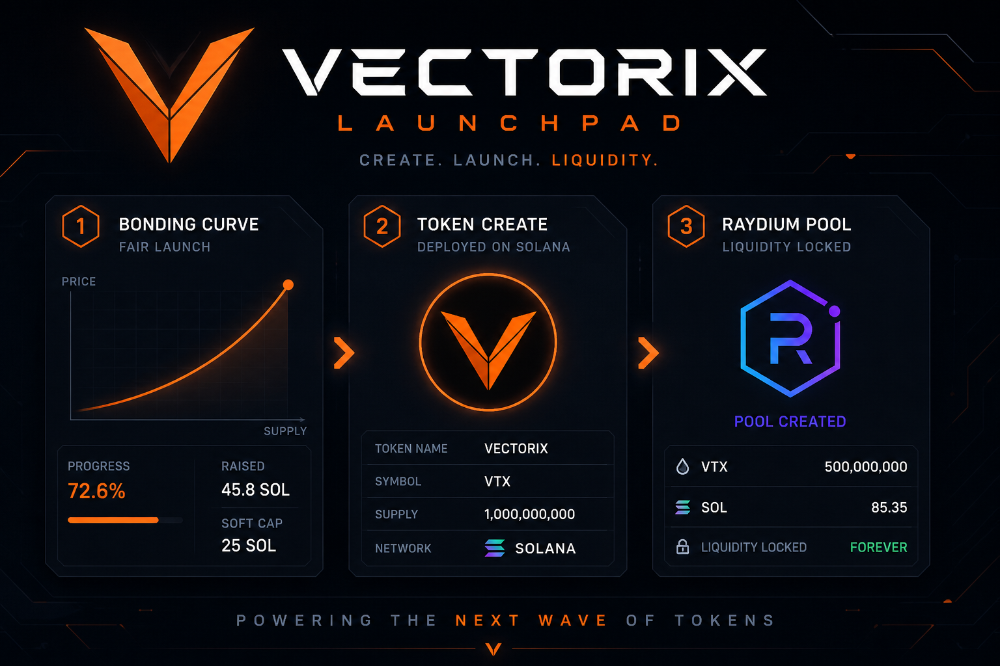

# Vectorix Web3 Projects

**Vectorix** (`vectorix-cross`) — Polymarket trading bots, Solana token launch and memecoin pools, crypto trading automation, and on-chain market tooling.

Past and current Web3 builds across prediction markets, Solana DeFi, token launch infrastructure, and NFT tooling.

Most implementation repos stay private (client and production keys). Public catalog and paper engine: the [Polymarket trading bot](https://github.com/vectorix-cross/My-Polymarket-trading-bot-python). Message Vectorix to review proof of work.

## Contact

| Channel | Link |
|---------|------|
| **Email** | [vanjasretenovic4@gmail.com](mailto:vanjasretenovic4@gmail.com) |
| **Telegram** | [@vectoris_corss](https://t.me/vectoris_corss) |
| **Discord** | [vectorix-cross](https://discord.com/users/775389898794336316) |
| **X (Twitter)** | [@vectorix_cross](https://x.com/vectorix_cross) |
| **GitHub** | [vectorix-cross](https://github.com/vectorix-cross) |

Portfolio: [https://github.com/vectorix-cross](https://github.com/vectorix-cross)

---

### Trading bots (Solana)

Bundlers, volume makers, snipers, and copy-trading on Raydium, Pump.fun / Pump Swap, and Meteora.

- Bundler — Raydium launchpad / AMM / CPMM, Pump.fun, Meteora DLMM / DBC
- Token volume booster / maker
- Snipers
- Copy trading
- Arbitrage bot

Repos (private unless noted): [Solana-Trading-Bots](https://github.com/vectorix-cross/Solana-Trading-Bots), [Solana-arbitrage-bot](https://github.com/vectorix-cross/Solana-arbitrage-bot)

 

---

### Polymarket trading bot

Python engine for Polymarket 5-minute and 15-minute crypto Up/Down markets: Gamma discovery, live CLOB books, edge scoring, paper execution with risk caps.

- Public repo: [My-Polymarket-trading-bot-python](https://github.com/vectorix-cross/My-Polymarket-trading-bot-python)
- TWAP, sniper, ladder, stair, momentum, and market-making strategy notes
- Live wallet signing is not enabled in the public cut

 

---

### Pump.fun-style launchpad (Solana, EVM)

Frontend, backend, and bonding-curve contract for SPL token create, market create, and Raydium pool graduation.

- [pump-fun-frontend](https://github.com/vectorix-cross/pump-fun-frontend)
- [pump-fun-backend](https://github.com/vectorix-cross/pump-fun-backend)
- [pump-fun-smart-contract](https://github.com/vectorix-cross/pump-fun-smart-contract)
- [Solana-Pumpfun-Smart-Contract](https://github.com/vectorix-cross/Solana-Pumpfun-Smart-Contract)
- [solana-token-launchpad](https://github.com/vectorix-cross/solana-token-launchpad)

 

---

### Token launch, presale, and vesting (Solana)

- Token-2022 and whitelist: [Solana_token_2022](https://github.com/vectorix-cross/Solana_token_2022), [SPL_Token_whitelist](https://github.com/vectorix-cross/SPL_Token_whitelist)
- Presale / IDO: [Solana-Presale-Smart-contract](https://github.com/vectorix-cross/Solana-Presale-Smart-contract), [Solana-IDO-Contract](https://github.com/vectorix-cross/Solana-IDO-Contract), [token-presale](https://github.com/vectorix-cross/token-presale)
- Vesting: [sol-vest](https://github.com/vectorix-cross/sol-vest)
- Swap CPI: [SWAP-SOLANA](https://github.com/vectorix-cross/SWAP-SOLANA), [sol-swap-cpi](https://github.com/vectorix-cross/sol-swap-cpi), [raydium-cpi-example](https://github.com/vectorix-cross/raydium-cpi-example), [jupiter-cpi](https://github.com/vectorix-cross/jupiter-cpi)

---

### NFT staking, raffle, and games (Solana)

- NFT staking: [solana-nft-staking](https://github.com/vectorix-cross/solana-nft-staking)
- NFT raffle: [nft-raffle](https://github.com/vectorix-cross/nft-raffle)
- Reward / jackpot: [Solana-reward-smart-contract](https://github.com/vectorix-cross/Solana-reward-smart-contract), [solana-simple-jackpot](https://github.com/vectorix-cross/solana-simple-jackpot)

---

### Payments and other chains

- x402 micropayments: [x402-micropayments](https://github.com/vectorix-cross/x402-micropayments), [x402-Solana-demo](https://github.com/vectorix-cross/x402-Solana-demo)
- Sui: [Sui-Examples](https://github.com/vectorix-cross/Sui-Examples), [Sui-flow](https://github.com/vectorix-cross/Sui-flow), [nft-protocol-sui](https://github.com/vectorix-cross/nft-protocol-sui)
- EVM study and demos: [solidity-course](https://github.com/vectorix-cross/solidity-course), [the-blockchain-bar](https://github.com/vectorix-cross/the-blockchain-bar)

---

## Why this repository

Vectorix keeps this overview as a map of Web3 work:

- Solana trading automation
- Pump.fun / launchpad stacks
- Token presale, whitelist, and vesting
- NFT staking and raffle
- Polymarket prediction-market bots

Custom strategy work and production deployments: use the contact table above.
